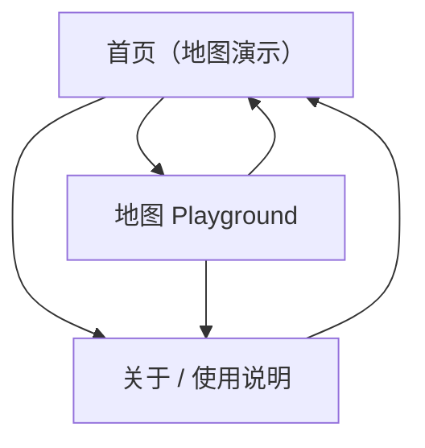

## 1. Product Overview
一个用于快速启动的 React + Mapbox GL JS 前端脚手架：开箱即用地渲染地图、展示基础交互与常用控件。
面向开发者/学习者，提供“可运行、可扩展、结构清晰”的项目骨架，不包含任何业务域逻辑。

## 2. Core Features

### 2.1 Feature Module
该脚手架由以下核心页面组成：
1. **首页（地图演示）**：地图初始化、基础控件、示例图层与标注、交互事件展示。
2. **地图 Playground**：地图样式切换、视图参数调试、图层/数据开关（仅示例）。
3. **关于 / 使用说明**：本地运行指引、Token 配置说明、常见问题。

### 2.2 Page Details
| Page Name | Module Name | Feature description |
|-----------|-------------|---------------------|
| 首页（地图演示） | 应用骨架 | 提供顶栏导航与主内容区；显示当前构建信息（如环境/版本）与基础布局示例。 |
| 首页（地图演示） | 地图渲染 | 初始化 Mapbox 地图（token、style、center、zoom）；在容器尺寸变化时自适配。 |
| 首页（地图演示） | 基础控件 | 展示缩放/旋转控件、全屏控件、比例尺（可按配置启用/禁用）。 |
| 首页（地图演示） | 示例数据展示 | 渲染少量示例 Marker / Popup；渲染 1 个示例 GeoJSON source + layer（如点/线/面任选其一）。 |
| 首页（地图演示） | 交互事件 | 响应点击/悬停并在页面侧栏/面板展示事件信息（经纬度、当前 zoom、选中要素属性）。 |
| 首页（地图演示） | 异常与空态 | 在缺少 Token 或地图加载失败时展示明确错误提示与排查指引链接。 |
| 地图 Playground | 样式切换 | 切换预置 style（如 streets / light / dark / satellite）；切换后保持当前视图（center/zoom）。 |
| 地图 Playground | 视图参数调试 | 通过表单输入/滑杆修改 center、zoom、bearing、pitch，并可一键重置默认值。 |
| 地图 Playground | 图层/数据开关 | 开关示例 layer 显示隐藏；开关示例数据（Marker/GeoJSON）以验证渲染路径。 |
| 地图 Playground | 开发信息面板 | 显示 Mapbox 相关状态（style loaded、sources、layers 数量、最后一次事件）。 |
| 关于 / 使用说明 | 快速开始 | 说明安装依赖、启动开发服务器、构建产物命令。 |
| 关于 / 使用说明 | 配置说明 | 说明 Mapbox Access Token 的配置方式（环境变量/本地 .env）；说明不应提交敏感 Token。 |
| 关于 / 使用说明 | 扩展指引 | 说明如何新增页面、封装 Map 组件、添加 source/layer、组织示例数据目录结构。 |

## 3. Core Process
- 访问首页后，你可以立即看到地图渲染结果，并通过控件进行缩放、旋转、全屏等基础操作。
- 你可以点击地图或示例要素，页面会显示交互事件与要素属性，便于验证事件链路。
- 进入 Playground 后，你可以切换地图样式、调试视图参数，并开关示例图层/数据来验证渲染与状态管理。
- 当 Token 缺失或地图加载失败时，你会看到错误提示与下一步排查建议。

