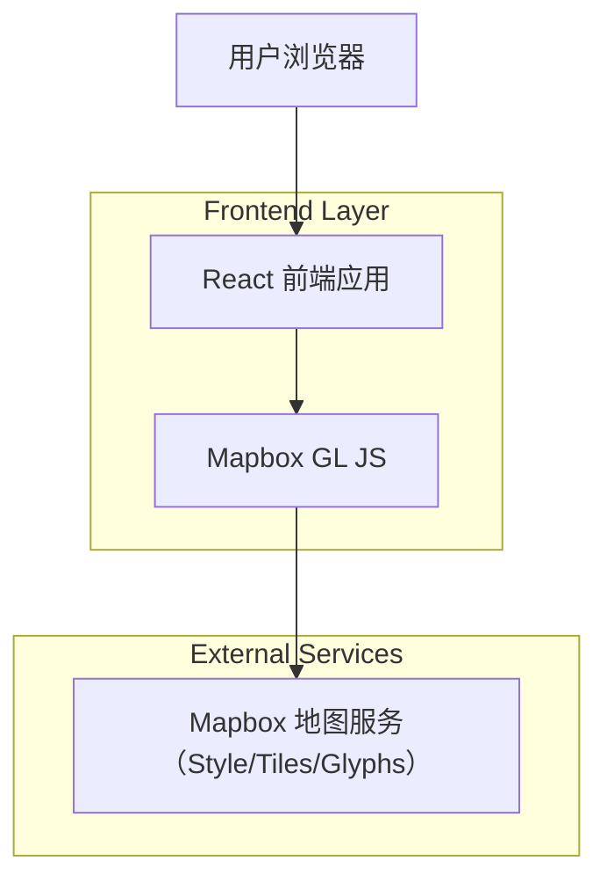

## 1.Architecture design

## 2.Technology Description
- Frontend: React@18 + TypeScript + vite
- Map: mapbox-gl（Mapbox GL JS）
- Routing: react-router-dom（3 个页面的最小路由）
- Backend: None

## 3.Route definitions
| Route | Purpose |
|-------|---------|
| / | 首页（地图演示）：地图初始化、基础控件、示例图层/标注与事件面板 |
| /playground | 地图 Playground：style 切换、视图参数调试、示例图层/数据开关 |
| /about | 关于/使用说明：运行与配置指引、扩展说明 |

## 4.API definitions (If it includes backend services)
不包含后端服务与自定义 API。

## 6.Data model(if applicable)
不包含数据库与数据模型；示例数据以本地静态 GeoJSON/JSON 文件形式存在即可。